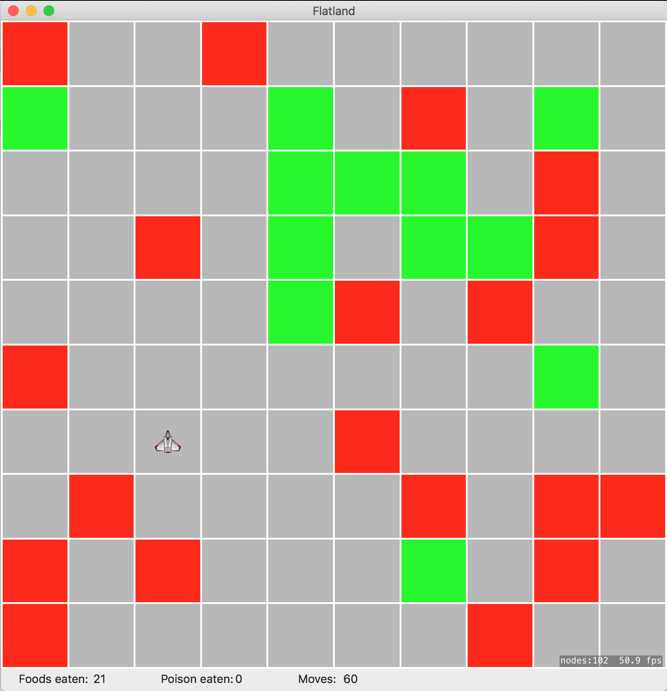

Flatland–An evolving neural network for training an agent navigating the world
--------------------------------------------------------------------------

Jon Tingvold · 2016

In this school project, I trained an agent to navigate a 2d world, with an evolving neural agent, a neural network trained with genetic algorithms instead of gradient descent. The neural network and genetic algorithm were written from scratch. The code is written in Swift for Mac/OS X.

The goal of the agent is to eat as much food (green) as possible and avoid poison (red) during only 60 time steps. The agent has tree possible decisions in each time step: move forward, rotate 90 degrees to the left, and rotate 90 degrees to the right. 

The phenotypes are evaluated based on their performance in five simulations of the game. The population size is 20 and the genetic algorithm runs for 50 generations.

Screenshot
----------

License
-------

[MIT](LICENSE)

